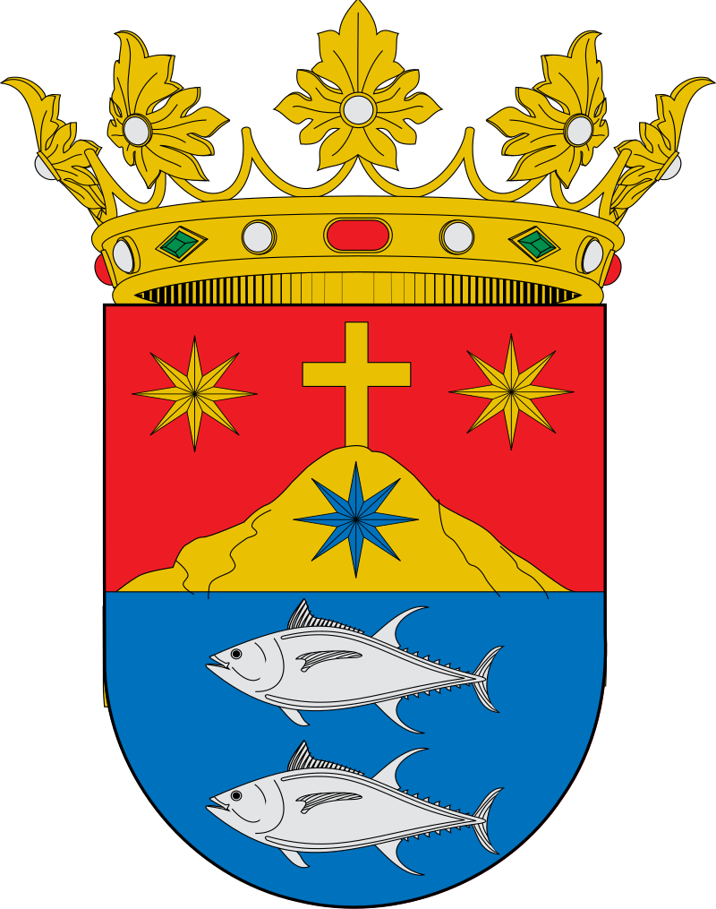

# MARKDOWN

## ¿QUE ES?

Markdown nació como herramienta de conversión de texto plano a HTML.

Aunque en realidad **Markdown** también se considera un lenguaje que tiene la finalidad de permitir crear contenido de una manera sencilla de escribir, y que en todo momento mantenga un diseño legible, así que para simplificar puedes considerar **Markdown** como un método de escritura.

Este método te permitirá añadir formatos tales como negritas, cursivas o enlaces, utilizando simplemente texto plano, lo que hará de tu escritura algo más simple y eficiente al evitar distracciones.

## ¿PARA QUE?

**Markdown** será perfecto para ti sobre todo si publicas de manera constante en Internet, donde el lenguaje HTML está más que presente: *WordPress, Squarespace, Jekyll…*

Pero no estoy hablando solo de blogs o páginas web. Servicios como Trello o foros como Stackoverflow también soportan este lenguaje, y con el paso del tiempo encontrarás aún más lugares que lo utilicen.

Además, **Markdown** está cada vez más extendido en el mundo “offline”. Nada te impedirá utilizar este lenguaje para tomar notas y apuntes de tus clases o reuniones en una determinada aplicación.

Incluso podrías escribir un libro con él, ya que puedes exportar fácilmente el resultado final a un formato ePub.

## Ejemplos

Codigo
`echo $_POST`

lista ordenada
1. punto uno
2. punto dos
3. punto tres...

lista desordenada
- punto uno
- punto dos
- punto tres...

Enlace
[Google](https://www.google.com)

Enlace archivo
[Readme.md](./Readme.md)

Imagen

Tabla
| X | Col 1 | Col 2 |
| - | ----- | ----- |
| Fila 1 | A | B |
| Fila 2 | C | D |

